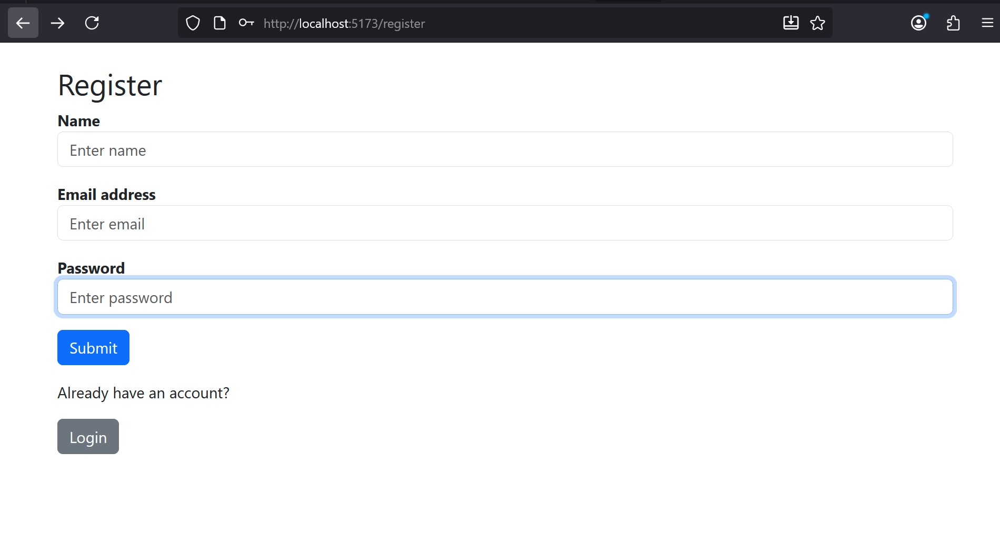
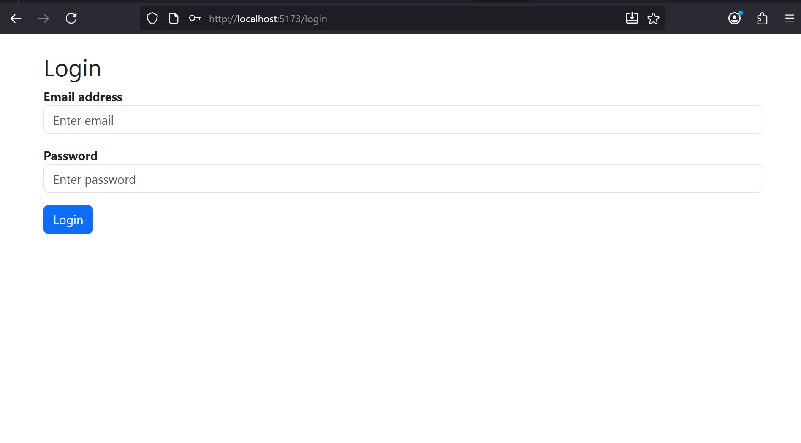
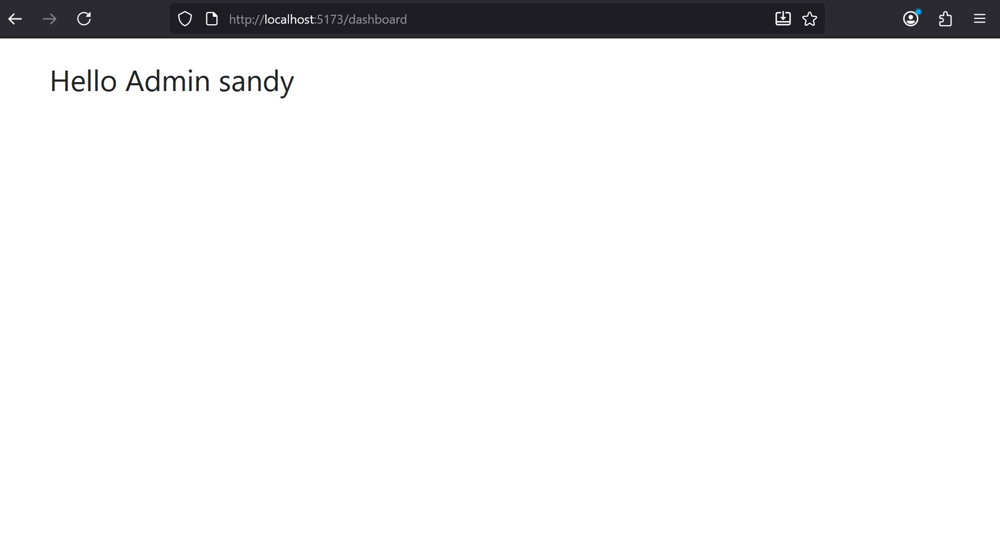

# Secure Login Dashboard

## Features Included
- **User Registration** – Users can sign up with name, email, password, and role.
- **User and Admin Login** – Users can log in with email and password.
- **JWT Authentication** – Backend generates JWT tokens after successful login.
- **Role-Based Access** – Dashboard shows different greetings or content for admin vs regular user.
- **Protected Routes** – Only logged-in users with a valid token can access the dashboard.
- **Logout** – Users can log out and remove their token from local storage.
- **Password Hashing** – Passwords are securely stored using bcrypt.
- **Frontend-Backend Communication** – React frontend communicates with Express backend via Axios.
- **CORS Support** – Backend allows cross-origin requests from frontend.

## Result

### 1. Register Form

### 2. Login Form

### 3. Dashboard

